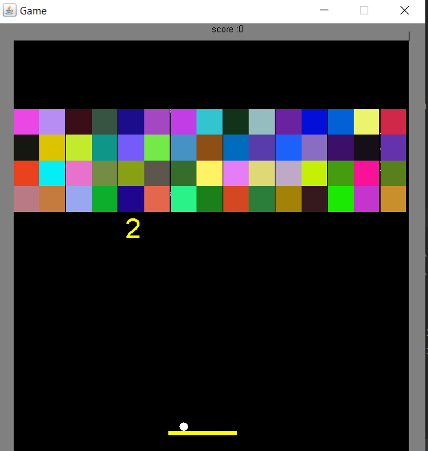
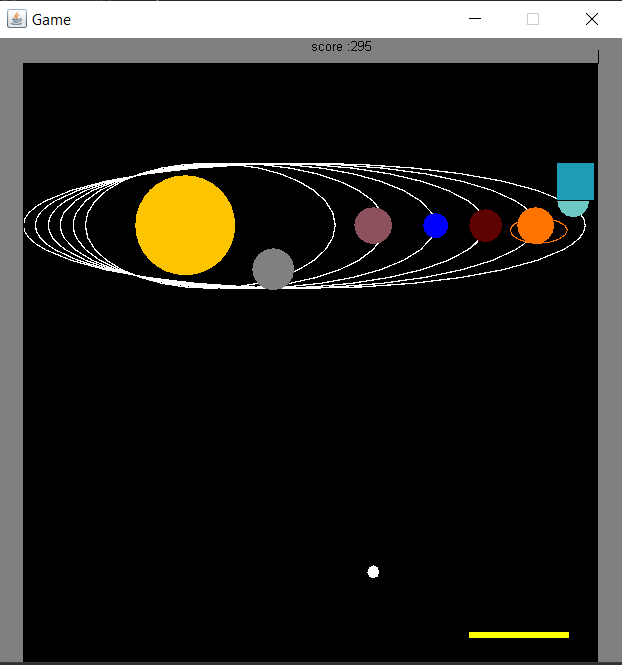

# Arkanoid Game (Java)

Welcome to **Arkanoid**, a classic brick-breaking game implemented from scratch in **Java**, as part of an academic-level project combining **object-oriented design**, **event-driven programming**, and **animation systems**.

This project demonstrates a high level of software engineering skills, including modular design, interface-based architecture, extendability, and clean coding practices.
## 🎮 Game Screenshots

<p align="center">
  
  
</p>


---
---

## 📚 Libraries & Architecture

- **biuoop.jar**: A lightweight Java GUI library designed for simple animation and keyboard handling, commonly used in academic settings.

- **Interfaces and Abstraction**:

  - Interfaces like `Sprite`, `Collidable`, `Animation`, and `LevelInformation` abstract the behavior of drawable, interactive, and game-controlling elements.
  - Encourages extensibility and loose coupling between components.

- **Abstract & Modular Design**:

  - Use of abstract classes and utility methods to encapsulate shared behaviors (e.g., `Block`, `Ball`, `Paddle` implementations).
  - Clear division between game logic (GameLevel, GameFlow), infrastructure (AnimationRunner), and visual components (Backgrounds).

- **Design Patterns**:

  - **Listener Pattern**: Classes like `BlockRemover` and `ScoreTrackingListener` implement a decoupled event-listening system using `HitListener`, allowing clean reaction to game events like block hits or ball removal.
  - **Wrapper/Decorator Pattern**: Used in classes like `KeyPressStoppableAnimation` and `GameOverStoppable`, which wrap other animations and add keyboard-controlled stop conditions without altering the original logic.
  - **Strategy Pattern**: Each level implements the `LevelInformation` interface, allowing easy switching or addition of new level behavior and settings.

This architectural approach ensures that the system is open for extension but closed for modification — promoting long-term scalability.

---

## 📖 Technologies & Concepts Used

- Java OOP principles (inheritance, interfaces, encapsulation)
- Custom animation loop and frame control
- Keyboard interaction with real-time response
- Sprite and collision management system
- Clean separation between rendering, logic, and game flow

---

## ✨ Project Highlights

- ⛳ **3 Fully Playable Levels**

  - Each with its own background theme and unique block layout
  - Increasing difficulty and challenge per level

- ⚔ **Dynamic Gameplay Elements**

  - Ball speed changes mid-game (slow down / speed up blocks)
  - Blocks that spawn or remove balls
  - Real-time paddle control

- ⏸ **Pause & Resume**

  - Press `SPACE` during the game to pause or resume

- 🎉 **End Screens**

  - `You Win` screen after completing all levels
  - `Game Over` screen when all balls are lost
  - Optional restart (`R`) or quit (`Q`) after game ends

- 📊 **Score Tracking System**

  - Points are awarded for breaking blocks
  - Score is displayed continuously during the game


## 🚀 How to Run

1. Compile the project:

   ```bash
   javac -cp biuoop.jar src/**/*.java
   ```

2. Run the main class:

   ```bash
   java -cp biuoop.jar:. src/Game/Main.java
   ```

> Ensure `biuoop.jar` is in your project directory.

---

## 🕹 Controls

| Key   | Action                   |
| ----- | ------------------------ |
| ← / → | Move paddle left / right |
| SPACE | Pause / Continue         |
| R     | Restart after Game Over  |
| Q     | Quit after Game Over     |

---

## 💡 Possible Extensions

- Multiple lives system
- Power-ups (multi-ball, laser, sticky paddle)
- Level designer tool
- Sound effects and background music

---

## 🚀 Professional Quality

This project reflects **professional-level game development practices**:

- Fully modular and scalable code structure
- Clear API between core systems (animation, game objects, input)
- Clean separation of concerns and proper encapsulation
- Easy to add new levels or mechanics without breaking existing code
- Uses classic design patterns for event handling and animation control

It serves as an impressive academic or portfolio project that demonstrates advanced Java skills, thoughtful design, and clean code architecture.

---

Built with ❤️ and Java. Enjoy the game!
